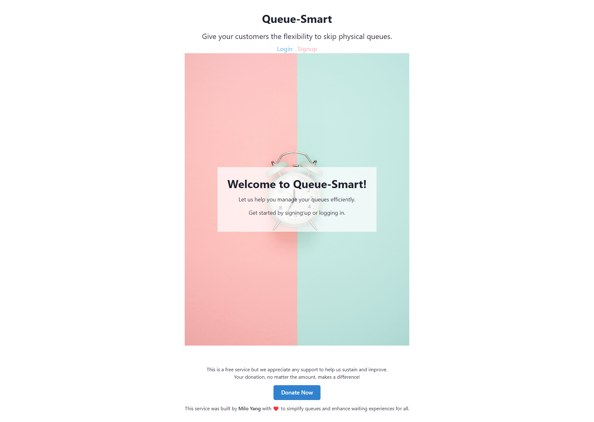

# Queue-Smart

Queue-Smart is a digital queue management system designed to enhance the dining experience for both customers and restaurant owners. By leveraging QR codes and mobile technology, Queue-Smart allows customers to join a digital queue seamlessly, enabling restaurant owners and employees to efficiently manage table allocations and notify customers when their table is ready.

## Table of Contents
- [Project Overview](#project-overview)
- [User Stories](#user-stories)
- [Setup](#setup)
- [Usage](#usage)
- [Contributing](#contributing)
- [License](#license)
- [Contact](#contact)

## Project Overview

Queue-Smart utilizes modern technologies to create a robust and efficient queue management system:

- **GraphQL**: Implemented with a Node.js and Express.js server to handle queries and mutations efficiently.
- **MongoDB and Mongoose**: Used as the database technology and Object Data Modeling (ODM) library, respectively, for storing and managing application data.
- **React**: Utilized for the front-end to create an intuitive and responsive user interface.
- **JWT (JSON Web Tokens)**: Employed for authentication, ensuring secure access to the application's features.
- **Twilio**: Integrated for sending text messages to notify customers when their table is ready.
- **Stripe**: Integrated for donation processing, allowing users to contribute to the platform if desired.
- **Render**: Deployed on Render for seamless deployment and hosting of the application.

(<a href="#readme-top">back to top</a>)

## User Stories

### As a Customer:

- **Objective**: To seamlessly join a digital queue and receive notifications when a table is available.

1. **Joining the Queue**
   - As a customer, I can share my name and mobile number with the restaurant.
   - This information allows the restaurant to notify me via text message when my table is ready.
   - I no longer need to physically line up outside the venue, enhancing my overall dining experience.

### As a Restaurant Owner/Employee:

- **Objective**: To efficiently manage table allocations and streamline the dining process for customers.

1. **Digital Table Tracking**
   - As a restaurant owner or employee, I can digitally track and allocate available tables to customers waiting in line.
   - This digital tracking system enhances efficiency for employees and allows customers to spend their time more effectively rather than physically queueing.

(<a href="#readme-top">back to top</a>)

## Setup

To set up and run Queue-Smart locally, follow these steps:

1. Clone the repository: `git clone https://github.com/miloyang/Queue-Smart.git`
2. Navigate to the project directory: `cd Queue-Smart`
3. Install dependencies: `npm install`
4. Start the development server: `npm run develop`

## Usage

To use the deployed site, please head over to: 

You should see the page as below:

(<a href="#readme-top">back to top</a>)

## Contributing

Contributions to Queue-Smart are welcome! If you have any suggestions, bug reports, or feature requests, please open an issue or submit a pull request.

## License

Permission to use this application is granted under the MIT license.
Click on the link for more information: [MIT License Information](https://opensource.org/licenses/MIT)

(<a href="#readme-top">back to top</a>)

## Contact

GitHub Link: https://github.com/miloyang 
Email Address: <miloyang9@gmail.com> 
LinkedIn: https://www.linkedin.com/in/miloyang

(<a href="#readme-top">back to top</a>)
